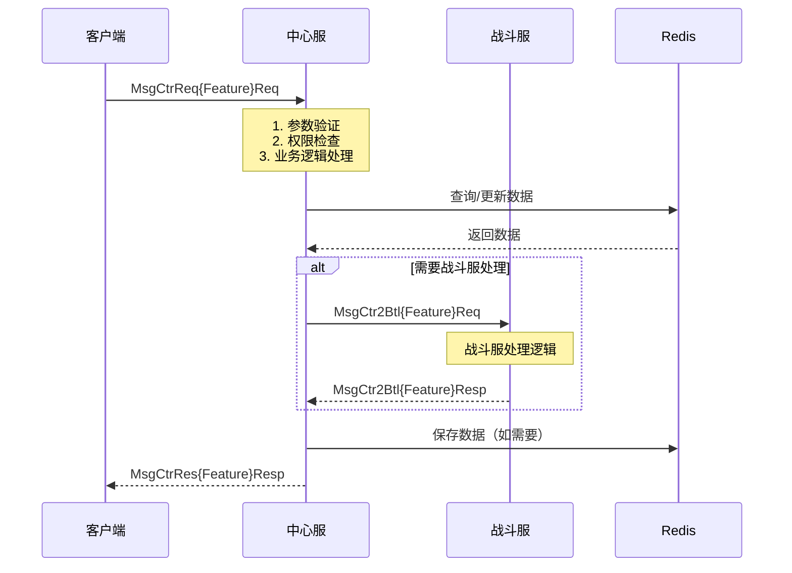
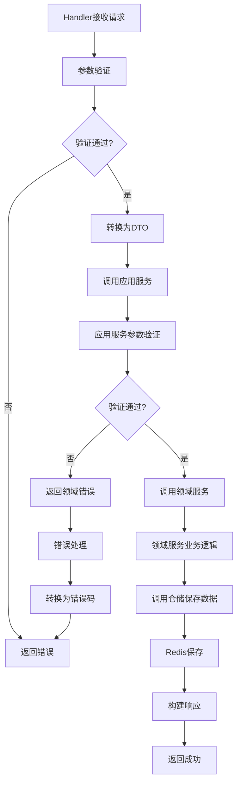
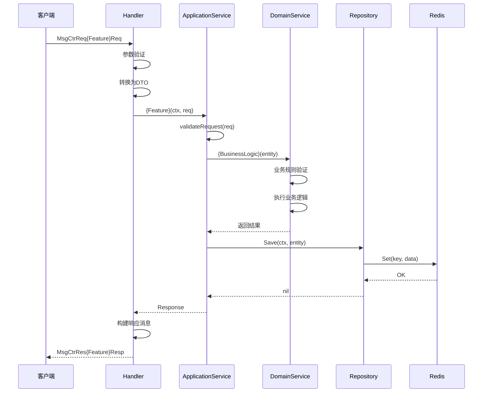

# 业务开发文档规则

## 文档适用范围

**本规则文档主要针对中心服逻辑开发的技术问题。**

- **适用范围**：
  - ✅ 中心服（CtrSvr）的业务逻辑开发
  - ✅ 中心服与客户端的交互协议设计
  - ✅ 中心服与战斗服的交互协议设计
  - ✅ 中心服内部的DDD架构设计和实现
  - ✅ 中心服的数据存储设计（Redis）
  - ✅ 中心服的错误处理和日志规范

- **不适用范围**：
  - ❌ 战斗服（Battle Server）的内部逻辑开发（战斗服有独立的开发规范）
  - ❌ 客户端（Client）的开发（客户端有独立的开发规范）
  - ❌ 前端UI设计和交互逻辑（前端有独立的开发规范）

- **说明**：
  - 虽然文档中会涉及客户端和战斗服的交互，但重点在于**中心服如何处理这些交互**
  - 文档中的流程图和协议设计，主要描述**中心服的处理逻辑**
  - 文档中的代码实现规范，主要针对**中心服的代码实现**

## 文档目标

本规则文档用于生成**中心服开发技术文档**，目标包括：

1. **指导开发人员**：明确如何进行中心服功能开发，提供完整的开发指南
2. **指导AI开发**：提供给AI读取后，能够按照规范进行中心服功能开发
3. **统一开发标准**：确保所有中心服功能开发遵循相同的架构和规范
4. **提高开发效率**：通过标准化流程和模板，减少重复工作

## 如何使用本规则文档

### 文档生成分层说明

**文档生成分为两部分：服务器需求文档和开发文档。**

- **服务器需求文档**：包含业务概述、DDD架构设计、协议设计、数据存储设计
- **开发文档**：包含其他细节数据（用户场景、功能需求、配置设计、测试策略、实施计划、代码实现规范等）

**本规则文档用于生成这两部分文档**，按照"开发文档最终内容"章节的结构生成。

### 生成开发文档的流程

**重要**：文档生成必须按照顺序进行，先生成服务器需求文档并审核通过后，再生成开发文档。

#### 步骤1：输入准备

- 收集策划文档或功能描述
- 确定涉及的领域和子域
- 查找相关的现有文档（`doc/`、`docs/` 目录）
- 检查是否已有服务器需求文档（如果已有，直接进入步骤3审核）

#### 步骤2：生成服务器需求文档 *(mandatory)*

**必须先生成服务器需求文档，包含以下内容：**

- **业务概述** *(mandatory)*：业务背景、业务价值、影响范围
- **DDD架构设计** *(mandatory)*：涉及的领域、使用的设计模式、新增/调整的文件和目录、领域实体和服务
- **协议设计** *(mandatory)*：Protobuf协议定义、消息结构、消息流向、业务流程图
- **数据存储设计** *(mandatory)*：Redis存储设计（Key格式、数据结构、存储内容、存储策略）

**保存路径**：`docs/design/server/{系统名称}/{系统名称}-服务器需求.md`

**文档结构**：按照本规则文档"第一部分：服务器需求文档内容"章节的结构生成

**生成后状态**：文档状态设置为 `Draft`（草稿），等待审核

#### 步骤3：服务器需求文档审核 *(mandatory)*

**服务器需求文档生成后，必须进行审核，审核通过后才能生成开发文档。**

##### 审核检查清单

**架构设计审核**：
- [ ] DDD架构设计是否清晰？涉及的领域和子域是否明确？
- [ ] 使用的设计模式是否合理？设计模式的使用原因和位置是否说明清楚？
- [ ] 新增/调整的文件和目录结构是否符合DDD规范？
- [ ] 领域实体和服务的职责是否明确？

**协议设计审核**：
- [ ] 协议消息结构是否完整？字段定义是否清晰？
- [ ] 消息流向是否正确？客户端、中心服、战斗服的交互是否明确？
- [ ] 是否绘制了客户端-中心服-战斗服交互流程图（如果涉及战斗服）？
- [ ] 是否绘制了中心服内部处理流程图？
- [ ] 是否绘制了业务流程时序图（如果流程复杂）？
- [ ] 流程图是否清晰展示了消息流向和处理步骤？

**数据存储设计审核**：
- [ ] Redis Key格式是否使用工具包函数？Key命名是否规范？
- [ ] 数据结构选择是否合理（Hash/String/Set/List）？
- [ ] 存储内容描述是否清晰？存储策略是否明确（过期时间、持久化策略等）？
- [ ] 是否考虑了数据一致性和并发安全？

**业务概述审核**：
- [ ] 业务背景描述是否清晰？
- [ ] 业务价值是否明确？
- [ ] 影响范围是否完整？

##### 审核结果处理

**审核通过**：
- 将文档状态更新为 `Approved`（已审核）
- 在文档中添加审核人信息和审核日期
- 进入步骤4生成开发文档

**审核不通过**：
- 将审核意见记录在文档中
- 根据审核意见修改服务器需求文档
- 重新提交审核，直到审核通过

**审核状态标记**：
- 在文档元信息中添加审核状态字段：
  - `Draft`：草稿，待审核
  - `In Review`：审核中
  - `Approved`：已审核通过
  - `Rejected`：审核不通过，需要修改

#### 步骤4：生成开发文档 *(mandatory)*

**服务器需求文档审核通过后，才能生成开发文档。**

**开发文档必须基于审核通过的服务器需求文档生成。**

**必须生成开发文档，包含以下内容：**

- **文档元信息**：功能名称、创建日期、状态、输入来源、涉及领域、关联文档（服务器需求文档路径）
- **用户场景与测试用例** *(mandatory)*：用户故事、验收场景、边界情况
- **功能需求** *(mandatory)*：功能性需求、非功能性需求、策划文档问题整理
- **配置设计** *(mandatory)*：使用的配置表列表和用途、配置缺失处理
- **成功标准** *(mandatory)*：可衡量的结果、技术指标
- **测试策略** *(mandatory)*：单元测试、集成测试、接口测试
- **实施计划** *(mandatory)*：开发顺序和步骤、开发检查点、依赖关系
- **风险评估**：技术风险、业务风险、兼容性风险
- **错误处理设计** *(mandatory)*：错误码定义、错误类型定义、错误处理流程
- **消息处理流程设计** *(mandatory)*：Handler实现模式、标准处理流程、Handler代码模板
- **代码实现规范** *(mandatory)*：实体、仓储、应用服务的实现模板
- **日志记录规范** *(mandatory)*：日志级别使用、日志格式规范
- **数据验证规范** *(mandatory)*：输入验证、验证示例
- **依赖注入规范** *(mandatory)*：依赖注入原则、依赖注入示例
- **AI代码生成提示** *(mandatory)*：代码生成注意事项、代码生成检查清单
- **文档更新清单** *(mandatory)*：需要更新的文档列表
- **开发前准备** *(mandatory)*：环境检查、依赖确认、代码库检查
- **开发常见问题处理**：配置缺失问题、协议冲突问题、领域边界问题、性能问题
- **代码提交规范**：提交前检查、提交信息格式
- **测试数据准备**：单元测试数据、集成测试数据、接口测试数据

**保存路径**：`docs/design/server/{系统名称}/{系统名称}-开发文档.md`

**文档结构**：按照本规则文档"第二部分：开发文档内容"章节的结构生成

**注意**：
- 开发文档中的架构设计、协议设计、数据存储设计应该引用服务器需求文档，不需要重复详细描述
- 如果服务器需求文档中的设计有调整，开发文档需要同步更新
- **禁止在技术文档中包含伪代码**：技术文档只关注设计、架构、流程，不包含具体的代码实现细节和业务逻辑伪代码
- **代码生成是开发实施阶段的任务**：具体的代码实现应该在开发实施阶段完成，而不是在文档生成阶段

#### 步骤5：开发文档审查

- 检查开发文档是否包含所有必填章节（标记为 `*(mandatory)` 的章节）
- **验证参数定义清单是否完整**（DD-1.1 章节）
  - 是否定义了所有功能开发中使用的参数？
  - 每个参数是否明确了配置位置（配置表名称、字段名、路径）？
  - 文档后续章节中是否使用参数名称而不是具体值？
- 验证开发文档是否引用了审核通过的服务器需求文档
- 验证配置清单、问题清单是否完整
- 确认实施计划是否清晰可行
- 验证代码模板和规范是否完整

#### 步骤6：开发实施

**这是代码生成和实现的阶段，不是文档生成阶段。**

- 按照开发文档中的"实施计划"进行开发
- 遵循代码实现规范和设计模式
- **在开发实施阶段生成具体的代码实现**（包括业务逻辑、错误处理、日志记录等）
- 完成代码后检查"代码生成检查清单"
- 参考开发文档中的代码结构模板，实现具体的业务逻辑

**注意**：
- 技术文档中只提供代码结构模板和规范，不包含具体的业务逻辑实现
- 具体的代码实现（包括业务逻辑、错误处理、日志记录等）应该在开发实施阶段完成
- 开发文档中的代码模板只是结构框架，需要在开发实施阶段填充具体的业务逻辑

### AI使用指南

当AI使用本规则文档生成文档时：

#### 生成服务器需求文档时

1. **必须遵循**：所有标记为 `*(mandatory)` 的章节都必须包含
2. **必须包含**：业务概述、DDD架构设计、协议设计、数据存储设计
3. **必须绘制流程图**：客户端-中心服-战斗服交互流程图、中心服内部处理流程图、业务流程时序图
4. **参考模板**：使用提供的代码模板和示例格式
5. **引用规范**：引用 `.cursor/rules/coding-standards.mdc` 获取详细规范
6. **生成后状态**：文档状态设置为 `Draft`，等待审核
7. **禁止伪代码**：不包含业务逻辑伪代码，只关注设计、架构、流程

#### 生成开发文档时

1. **前置条件**：必须基于审核通过的服务器需求文档生成（状态为 `Approved`）
2. **必须遵循**：所有标记为 `*(mandatory)` 的章节都必须包含
3. **必须定义参数**：在 DD-1.1 参数定义清单章节中，必须定义所有功能开发中使用的参数
   - 每个参数必须明确配置位置（配置表名称、字段名、路径）
   - 文档后续章节中必须使用参数名称（`PARAM_{参数名称}`），而不是具体值
   - 代码示例中必须展示如何从配置读取参数
4. **必须引用**：开发文档中必须引用服务器需求文档，避免重复描述架构、协议、数据存储设计
5. **参考模板**：使用提供的代码模板和示例格式
6. **引用规范**：引用 `.cursor/rules/coding-standards.mdc` 获取详细规范
7. **检查清单**：生成文档后，必须检查"文档更新清单"和"代码生成检查清单"
8. **禁止伪代码**：不包含业务逻辑伪代码，只提供代码结构模板和规范，具体的代码实现在开发实施阶段完成

#### 文档生成顺序

**⚠️ 重要**：必须严格按照以下顺序生成文档：

1. **第一步**：生成服务器需求文档（步骤2）
2. **第二步**：审核服务器需求文档（步骤3）
3. **第三步**：审核通过后，生成开发文档（步骤4）

**禁止**：在服务器需求文档审核通过之前生成开发文档

## 基础规则

- **必须考虑用户输入**：用户可能提供以下内容
        - 策划文档
        - 影响的领域
  - 功能描述
  - 其他相关信息

## 基础知识

### 中心服开发重点

**本规则文档专注于中心服（CtrSvr）的逻辑开发，重点关注：**

- **中心服业务逻辑**：中心服如何接收客户端请求、处理业务逻辑、返回响应
- **中心服架构设计**：中心服的DDD架构设计（领域层、应用层、基础设施层、接口层）
- **中心服数据存储**：中心服如何使用Redis存储数据（**注意：中心服只使用Redis，不使用MySQL**）
- **中心服协议设计**：中心服与客户端、战斗服的协议交互设计
- **中心服错误处理**：中心服如何定义错误码、处理错误、返回错误信息

**虽然文档中会涉及客户端和战斗服，但重点在于中心服的处理逻辑。**

### 输入要求

- 用户需要提供策划文档或相关描述
- 在项目中 `doc/`、`docs/` 目录中查找相关文档
- 项目基于 DDD 架构进行开发，如果用户描述中没有明确领域，需要提示用户指定领域
- **重点**：确定功能在中心服的哪个领域（game/login）和子域中实现

### 协议文件

- **Client to Server（中心服）**：`proto/CtrSvr.proto`
- **Server to Battle（战斗服）**：`proto/Ctr2BtlSvr.proto`
- **错误码**: `proto/EMsgErrorType.proto`

### 流程图规范

- **参考规范**：详细流程图绘制规范请参考 `docs/dev/guide/文档建议.md` 中的"流程图规范"章节
- **工具**：使用 Mermaid 语法绘制流程图
- **必须绘制**：
  - 客户端-中心服-战斗服交互流程图（如果涉及战斗服）
  - 中心服内部处理流程图
  - 业务流程时序图（如果流程复杂）

### Redis存储规范

**参考规范**：详细的Redis Key命名规范和使用规范请参考 `.cursor/rules/redis.mdc`。

**基本原则**：
- **统一管理**：所有 Redis Key 格式通过工具包统一管理，禁止硬编码
- **工具包位置**：`logic/game/infrastructure/rediskey/`（game 有界上下文内的共享基础设施）
- **符合 DDD**：工具包属于基础设施层，领域层不依赖它，只被 Repository 使用
- **易于维护**：所有 Key 格式集中管理，修改时只需更新一处

**Key命名格式**：
- **格式规则**：`{前缀}:{主体ID}:{功能}:{功能ID} = value`
- **前缀规范**：
  - `playerrole:` - 角色相关数据，格式：`playerrole:{角色ID}:{功能}:{功能ID} = value`
  - `player:` - 玩家相关数据，格式：`player:{玩家ID}:{角色ID} = value`

**工具包使用规范**：
- **导入工具包**：`import rediskey "server/cmd/growup/logic/game/infrastructure/rediskey"`
- **生成单个Key**：`key := rediskey.{Entity}{Feature}Key(id, featureId)`
- **生成模式匹配Key**：`pattern := rediskey.{Entity}{Feature}Pattern(id)`（用于批量查询）

**函数命名规范**：
- **单个Key生成函数**：`{Entity}{Feature}Key()`，如 `RoleSkillKey()`, `RoleEquipSchemeKey()`
- **模式匹配Key生成函数**：`{Entity}{Feature}Pattern()`，如 `RoleSkillsPattern()`, `RoleEquipSchemesPattern()`
- **特殊Key生成函数**：`{Entity}{Feature}{Specific}Key()`，如 `RoleSkillsCurrentStanceKey()`

**禁止事项**：
- ❌ **禁止硬编码**：不要在代码中直接使用字符串作为Redis Key
- ❌ **禁止跨领域共享**：不同领域的Redis Key不应该共享，应该各自定义
- ✅ **必须使用工具包**：所有Redis Key必须使用 `rediskey` 工具包函数生成

**详细规范**：请参考 `.cursor/rules/redis.mdc` 获取完整的Redis Key命名规范和使用规范。

### 配置文件

- **配置路径**：`cmd/growup/excel/`
- **配置要求**：
  - 开发文档需要依赖策划文档生成，所以要先导入新增配置内容
  - 策划文档中必须提供配置内容，如果没有，提示用户补充策划文档
  - 所有参数都应该来源于配置文档，不能在代码中写死参数
  - **如果需要的参数没有配置，必须在开发文档中整理出缺失配置清单，方便与策划同学交互确认**
  - 需要的配置在配置表中没有，可以在领域内增加一个配置文件，临时进行配置，后期进行替换

### 文档生成分层结构

**文档生成分为两部分：服务器需求文档和开发文档。**

#### 1. 服务器需求文档 *(mandatory)*

**定位**：中心服技术需求文档，面向开发人员，包含核心技术设计

**内容**：
- **业务概述**：业务背景、业务价值、影响范围
- **DDD架构设计** *(mandatory)*：涉及的领域、使用的设计模式、新增/调整的文件和目录、领域实体和服务
- **协议设计** *(mandatory)*：Protobuf协议定义、消息结构、消息流向、业务流程图
- **数据存储设计** *(mandatory)*：Redis存储设计（Key格式、数据结构、存储内容、存储策略）

**保存路径**：`docs/design/server/{系统名称}/{系统名称}-服务器需求.md`

**示例文档**：
- `docs/design/server/J-江湖宗师殿/江湖宗师殿-服务器需求.md`

#### 2. 开发文档 *(mandatory)*

**定位**：中心服开发细节文档，面向开发人员，包含开发实施细节

**内容**：
- **文档元信息**：功能名称、创建日期、状态、输入来源、涉及领域
- **用户场景与测试用例** *(mandatory)*：用户故事、验收场景、边界情况
- **功能需求** *(mandatory)*：功能性需求、非功能性需求、策划文档问题整理
- **配置设计** *(mandatory)*：使用的配置表列表和用途、配置缺失处理
- **成功标准** *(mandatory)*：可衡量的结果、技术指标
- **测试策略** *(mandatory)*：单元测试、集成测试、接口测试
- **实施计划** *(mandatory)*：开发顺序和步骤、开发检查点、依赖关系
- **风险评估**：技术风险、业务风险、兼容性风险
- **错误处理设计** *(mandatory)*：错误码定义、错误类型定义、错误处理流程
- **消息处理流程设计** *(mandatory)*：Handler实现模式、标准处理流程、Handler代码模板
- **代码实现规范** *(mandatory)*：实体、仓储、应用服务的实现模板
- **日志记录规范** *(mandatory)*：日志级别使用、日志格式规范
- **数据验证规范** *(mandatory)*：输入验证、验证示例
- **依赖注入规范** *(mandatory)*：依赖注入原则、依赖注入示例
- **AI代码生成提示** *(mandatory)*：代码生成注意事项、代码生成检查清单
- **文档更新清单** *(mandatory)*：需要更新的文档列表
- **开发前准备** *(mandatory)*：环境检查、依赖确认、代码库检查
- **开发常见问题处理**：配置缺失问题、协议冲突问题、领域边界问题、性能问题
- **代码提交规范**：提交前检查、提交信息格式
- **测试数据准备**：单元测试数据、集成测试数据、接口测试数据

**保存路径**：`docs/design/server/{系统名称}/{系统名称}-开发文档.md`

**示例文档**：
- `docs/design/server/J-江湖宗师殿/江湖宗师殿-开发文档.md`

#### 文档分层关系

```
策划文档（输入）
    ↓
服务器需求文档（技术设计）
    ↓
开发文档（开发细节）
    ↓
代码实现
```

**关系说明**：
- **策划文档 → 服务器需求文档**：将业务需求转化为技术设计方案（架构、协议、数据存储）
- **服务器需求文档 → 开发文档**：基于技术设计方案，生成详细的开发实施文档
- **开发文档 → 代码实现**：开发人员根据开发文档实现代码

### 文档保存路径

#### 服务器需求文档

- **保存路径**：`docs/design/server/{系统名称}-服务器需求.md`
- **示例**：`docs/design/server/武学技能-服务器需求.md`

#### 开发文档

- **新增系统**：`docs/design/server/{系统名称}/{系统名称}-开发文档.md`
- **已有系统**：判断是否已有开发文档
  - 如果已有文档，更新现有文档
  - 如果没有文档，新增文档

**示例**：
- `docs/design/server/J-江湖宗师殿/江湖宗师殿-开发文档.md`
- `docs/design/server/武学技能/武学技能-开发文档.md`

## DDD架构规范

- **参考规范**：读取 `.cursor/rules/coding-standards.mdc`
- **文档要求**：基于规范生成开发文档，用于描述需要调整的内容
        - 新增的文件、目录
        - 调整的文件、目录
  - **使用的设计模式**：必须说明代码开发过程中使用的设计模式（Repository、Factory、Specification、依赖注入等）

## 协议文件规范

- 参考已有协议文件中的规范，新增协议
- 遵循项目协议命名和结构规范

## 配置文件规范

- 新功能需要的配置是提前配置的，在开发文档中要描述如何使用配置
- 项目中所有的参数都应该来源于配置文档，不能在代码中写死参数
- **如果需要的参数没有配置，必须在开发文档中整理出缺失配置清单，方便与策划同学交互确认**
- 需要的配置在配置表中没有，可以在领域内增加一个配置文件，临时进行配置，后期进行替换
- **策划文档中不明确的或有冲突的内容，必须在开发文档中整理成问题清单，方便与策划同学交互确认**

## 开发文档最终内容

**本部分描述的是服务器需求文档和开发文档的结构和内容要求。**

**文档组织方式**：
- **服务器需求文档**：包含业务概述、DDD架构设计、协议设计、数据存储设计
- **开发文档**：包含其他细节数据（用户场景、功能需求、配置设计、测试策略、实施计划、代码实现规范等）

**注意**：
- 文档中的所有内容都应该从**中心服开发**的角度来描述，重点关注中心服如何处理业务逻辑、如何与客户端和战斗服交互、如何存储数据等
- **技术文档不包含伪代码**：技术文档只关注设计、架构、流程、规范，不包含具体的代码实现细节和业务逻辑伪代码
- **代码生成是开发实施阶段的任务**：具体的代码实现应该在开发实施阶段（步骤6）完成，而不是在文档生成阶段

---

## 第一部分：服务器需求文档内容

**服务器需求文档包含以下章节：**

**文档元信息模板**（必须放在文档开头）：

```markdown
## 文档元信息

- **功能名称**：`[功能名称]`
- **创建日期**：`[日期]`
- **最后更新**：`[日期]`
- **状态**：`Draft` / `In Review` / `Approved` / `Rejected`
- **审核人**：`待审核` / `[审核人姓名，审核后填写]`
- **审核日期**：`待审核` / `[审核日期，审核后填写]`
- **审核意见**：`待审核` / `[审核意见，如果审核不通过，记录审核意见]`
- **输入来源**：用户描述/策划文档：`"[描述内容]"`
- **涉及领域**：`[领域名称，如 game/login 等]`
```

**注意**：
- 文档生成时，状态默认为 `Draft`（草稿），审核人、审核日期、审核意见默认为 `待审核`
- 审核通过后，状态更新为 `Approved`，并填写审核人和审核日期
- 审核不通过时，状态更新为 `Rejected`，并记录审核意见

### SR-1. 业务概述 *(mandatory)*

- **业务背景**：描述业务背景和需求来源
- **业务价值**：描述该功能带来的业务价值
- **影响范围**：描述影响的模块、领域、系统等

### SR-2. DDD架构设计 *(mandatory)*

基于 `.cursor/rules/coding-standards.mdc` 规范，描述架构调整：

#### 涉及的领域

- **主领域**：`[领域名称，如 game/login]`
- **子域**：`[子域名称，如 user/account/player/battle]`
- **共享内核**：`[如果涉及 Shared Kernel，说明共享的实体或接口]`

#### 使用的设计模式 *(mandatory)*

**必须说明代码开发过程中使用的设计模式**。虽然整体架构是DDD，但业务开发中也会使用设计模式。

**参考规范**：详细的设计模式说明请参考 `.cursor/rules/coding-standards.mdc` 中的"设计模式"章节，包括：
- DDD架构中的设计模式：Repository模式、Factory模式、Specification模式、ValueObject模式等
- 通用设计模式：依赖注入、接口隔离原则、单一职责原则、开闭原则、依赖倒置原则等

**在开发文档中，必须明确说明**：

- **使用的设计模式**：列出功能开发中使用的所有设计模式（如Repository、Factory、依赖注入等）
- **使用原因**：说明为什么使用该设计模式
- **使用位置**：说明设计模式在代码中的具体位置（文件路径）
- **实现方式**：简要说明如何实现该设计模式

**示例格式**：

- **Repository模式**：
  - **使用原因**：需要持久化`{Entity}`实体，隔离领域层和基础设施层
  - **使用位置**：`domain/{subdomain}/repository/{entity}_repository.go`
  - **实现方式**：定义`{Entity}Repository`接口，提供`Save`、`FindByID`等方法

- **Factory模式**：
  - **使用原因**：`{Entity}`创建逻辑复杂，需要验证、初始化多个关联对象
  - **使用位置**：`domain/{subdomain}/factory/{entity}_factory.go`
  - **实现方式**：提供`Create{Entity}`方法，封装创建逻辑

- **依赖注入**：
  - **使用原因**：解耦依赖关系，提高可测试性和可维护性
  - **使用位置**：所有服务、Handler的构造函数
  - **实现方式**：通过构造函数注入Repository、Service等依赖

#### 新增的文件和目录

```
logic/{module}/domain/{subdomain}/
├── entity/
│   └── {new_entity}.go          # 新增实体
├── repository/
│   └── {new_repository}.go      # 新增仓储接口
├── service/
│   └── {new_service}.go         # 新增领域服务
└── infrastructure/
    └── repository/
        └── redis_{entity}_repository.go  # Redis实现（中心服只使用Redis）

logic/{module}/application/
├── service/
│   └── {new_app_service}.go     # 新增应用服务
└── dto/
    └── {new_dto}.go              # 新增DTO

logic/{module}/interfaces/
└── handler/
    └── {new_handler}.go         # 新增处理器
```

#### 调整的文件和目录

- **文件路径**：`[文件路径]`
  - **调整内容**：描述调整的内容和原因
  - **影响范围**：影响的其他模块或功能

#### 领域实体和服务

- **`[实体名称]`**：实体职责，关键属性，与其他实体的关系
- **`[领域服务名称]`**：服务职责，使用场景
- **`[应用服务名称]`**：应用服务职责，用例编排逻辑

### SR-3. 协议设计 *(mandatory)*

#### 新增协议

- **协议文件**：`proto/CtrSvr.proto` 或 `proto/Ctr2BtlSvr.proto`
- **消息名称**：`Msg{Feature}Req` / `Msg{Feature}Resp`
- **消息结构**：

```protobuf
message Msg{Feature}Req {
    uint64 playerRoleId = 1;
    // ... 其他字段
}

message Msg{Feature}Resp {
    EMsgErrorType error = 1;
    // ... 响应数据
}
```

- **消息流向**：`Client -> Server` / `Server -> Battle`

#### 调整协议

- **协议文件**：`[文件路径]`
- **调整内容**：描述调整的字段和原因
- **兼容性**：是否向后兼容，是否需要版本控制

### SR-3.1 业务流程图设计 *(mandatory)*

**必须绘制业务流程图，清晰展示系统交互逻辑和内部处理流程。**

#### 流程图绘制规范

- **工具**：使用 Mermaid 语法绘制流程图（参考 `docs/dev/guide/文档建议.md` 中的流程图规范）
- **类型**：根据场景选择合适的流程图类型
  - **序列图（Sequence Diagram）**：用于展示客户端、中心服、战斗服之间的交互时序
  - **流程图（Flowchart）**：用于展示中心服内部的处理流程
- **参与者命名**：使用清晰的中文名称，如"客户端"、"中心服"、"战斗服"、"Redis"等（**注意：中心服只使用Redis，不使用MySQL数据库**）

#### 必须绘制的流程图

##### 1. 客户端-中心服-战斗服交互流程图 *(mandatory)*

**如果功能涉及战斗服，必须绘制客户端、中心服、战斗服之间的交互流程图。**

**示例格式**：



**绘制要求**：
- 必须标注消息名称（如 `MsgCtrReq{Feature}Req`）
- 必须标注中心服和战斗服的处理步骤（使用 `Note over`）
- 必须标注条件分支（使用 `alt/else/end`）
- 必须标注错误处理流程

##### 2. 中心服内部处理流程图 *(mandatory)*

**必须绘制中心服内部的详细处理流程，展示从Handler到应用服务、领域服务、仓储的调用链。**

**示例格式**：



**绘制要求**：
- 必须展示完整的调用链：Handler → Application Service → Domain Service → Repository
- 必须标注关键判断点（使用菱形节点 `{}`）
- 必须标注错误处理流程
- 必须标注数据存储操作（Redis，**注意：中心服只使用Redis**）

##### 3. 业务流程时序图 *(mandatory)*

**对于复杂的业务流程，必须绘制详细的时序图，展示各组件之间的交互。**

**示例格式**：



**绘制要求**：
- 必须展示所有参与的组件（Handler、Application Service、Domain Service、Repository等）
- 必须标注方法调用名称
- 必须展示数据流向
- 必须标注错误处理路径

#### 流程图绘制检查清单

绘制流程图后，必须检查：

- [ ] 是否绘制了客户端-中心服-战斗服交互流程图（如果涉及战斗服）？
- [ ] 是否绘制了中心服内部处理流程图？
- [ ] 是否绘制了业务流程时序图（如果流程复杂）？
- [ ] 流程图是否清晰展示了消息流向？
- [ ] 流程图是否标注了关键判断点和错误处理？
- [ ] 流程图是否使用了标准的Mermaid语法？
- [ ] 参与者命名是否清晰易懂？

### SR-4. 数据存储设计 *(mandatory)*

**注意：中心服只使用Redis存储数据，不使用MySQL数据库。**

#### Redis存储规范

**参考规范**：详细的Redis Key命名规范和使用规范请参考 `.cursor/rules/redis.mdc`。

**基本原则**：
- **统一管理**：所有 Redis Key 格式通过工具包统一管理，禁止硬编码
- **工具包位置**：`logic/game/infrastructure/rediskey/`（game 有界上下文内的共享基础设施）
- **符合 DDD**：工具包属于基础设施层，领域层不依赖它，只被 Repository 使用
- **易于维护**：所有 Key 格式集中管理，修改时只需更新一处

#### Redis Key命名格式

**格式规则**：
```
{前缀}:{主体ID}:{功能}:{功能ID} = value
```

**前缀规范**：

- **`playerrole:`** - 角色相关数据
  - 格式：`playerrole:{角色ID}:{功能}:{功能ID} = value`
  - 示例：`playerrole:88888:skills:1001 = skill_data`
  - 说明：每个功能下的数据项独立存储为 String 结构，使用模式匹配读取

- **`player:`** - 玩家相关数据
  - 格式：`player:{玩家ID}:{角色ID} = value`
  - 示例：`player:1001:88888 = role_data`
  - 说明：通过 `KEYS player:{玩家ID}:*` 可以读取该玩家的所有角色ID

**详细规范**：请参考 `.cursor/rules/redis.mdc` 中的"Key 命名格式"章节。

#### Redis工具包使用规范

**工具包位置**：
```
cmd/growup/logic/game/infrastructure/rediskey/
├── {entity}_{feature}_key.go  # Key 生成函数文件
└── README.md                   # 工具包说明文档
```

**使用方式**：

```go
// 导入工具包
import rediskey "server/cmd/growup/logic/game/infrastructure/rediskey"

// 生成单个 Key
key := rediskey.{Entity}{Feature}Key(id, featureId)

// 生成模式匹配 Key（用于批量查询）
pattern := rediskey.{Entity}{Feature}Pattern(id)
keys, _ := redis.GameRedis().Keys(ctx, pattern).Result()
```

**函数命名规范**：
- **单个 Key 生成函数**：`{Entity}{Feature}Key()`，如 `RoleSkillKey()`, `RoleEquipSchemeKey()`
- **模式匹配 Key 生成函数**：`{Entity}{Feature}Pattern()`，如 `RoleSkillsPattern()`, `RoleEquipSchemesPattern()`
- **特殊 Key 生成函数**：`{Entity}{Feature}{Specific}Key()`，如 `RoleSkillsCurrentStanceKey()`

**详细规范**：请参考 `.cursor/rules/redis.mdc` 中的"工具包使用规范"章节。

#### Redis存储设计要求

在服务器需求文档中，数据存储设计章节必须包含：

- **Key格式**：使用 `rediskey` 工具包函数，如 `rediskey.RoleSkillKey(playerRoleId, skillId)`
- **Key生成函数**：列出所有需要新增的Key生成函数（在 `rediskey` 工具包中）
- **数据结构**：`Hash` / `String` / `Set` / `List` 等
- **存储内容**：描述存储的数据内容（字段、格式等）
- **存储策略**：描述数据的存储策略（如过期时间、持久化策略等）
- **批量查询模式**：如果需要批量查询，说明使用的模式匹配Key格式

#### Redis Key生成函数定义

**在服务器需求文档中，必须列出所有需要新增的Redis Key生成函数：**

```go
// 示例：在 rediskey 工具包中新增的函数
// logic/game/infrastructure/rediskey/{entity}_{feature}_key.go

// {Entity}{Feature}Key 生成单个Key
func {Entity}{Feature}Key(id uint64, featureId uint32) string {
    return core.Sprintf("{prefix}:%d:{feature}:%d", id, featureId)
}

// {Entity}{Feature}Pattern 生成模式匹配Key（用于批量查询）
func {Entity}{Feature}Pattern(id uint64) string {
    return core.Sprintf("{prefix}:%d:{feature}:*", id)
}
```

**禁止事项**：
- ❌ **禁止硬编码**：不要在代码中直接使用字符串作为Redis Key
- ❌ **禁止跨领域共享**：不同领域的Redis Key不应该共享，应该各自定义
- ✅ **必须使用工具包**：所有Redis Key必须使用 `rediskey` 工具包函数生成

**详细规范**：请参考 `.cursor/rules/redis.mdc` 中的"禁止事项"章节。

---

## 第二部分：开发文档内容

**开发文档包含以下章节：**

参考 `.specify/templates/spec-template.md` 模板：

### DD-1. 文档元信息

- **功能名称**：`[功能名称]`
- **创建日期**：`[日期]`
- **状态**：`Draft` / `In Progress` / `Completed`
- **输入来源**：用户描述/策划文档：`"[描述内容]"`
- **涉及领域**：`[领域名称，如 game/login 等]`
- **关联文档**：`docs/design/server/{系统名称}-服务器需求.md`

### DD-1.1 参数定义清单 *(mandatory)*

**重要**：本节必须在开发文档开头定义所有功能开发中使用的参数，包括配置表参数、业务参数、系统参数等。后续文档中引用参数时，必须使用本节定义的参数名称，而不是具体值。

**目的**：
- 明确所有参数的配置位置和来源
- 避免AI在代码实现时硬编码参数值
- 确保所有参数都来源于配置，便于后续维护和调整

#### 参数定义格式

每个参数必须包含以下信息：

- **参数名称**：参数的标识名称（用于文档中引用）
- **参数说明**：参数的用途和含义
- **配置位置**：参数所在的配置表或配置文件
  - **配置表名称**：如 `CtMartialArts`、`CtLevel` 等
  - **配置字段名**：配置表中的字段名称
  - **配置路径**：`cmd/growup/excel/`
- **参数类型**：参数的数据类型（如 `uint32`、`string`、`bool` 等）
- **默认值**：参数的默认值（如果有）
- **使用位置**：参数在代码中的使用位置（文件路径或功能模块）

#### 参数定义示例

```markdown
#### 配置表参数

- **PARAM_SKILL_MAX_LEVEL**：
  - **参数说明**：技能最大等级限制
  - **配置位置**：
    - **配置表名称**：`CtMartialArts`
    - **配置字段名**：`MaxLevel`
    - **配置路径**：`cmd/growup/excel/CtMartialArts.csv`
  - **参数类型**：`uint32`
  - **默认值**：`10`
  - **使用位置**：技能学习、技能升级功能

- **PARAM_SKILL_LEARN_COST**：
  - **参数说明**：技能学习消耗的资源数量
  - **配置位置**：
    - **配置表名称**：`CtMartialArts`
    - **配置字段名**：`LearnCost`
    - **配置路径**：`cmd/growup/excel/CtMartialArts.csv`
  - **参数类型**：`uint32`
  - **默认值**：`100`
  - **使用位置**：技能学习功能

#### 业务参数

- **PARAM_MAX_ROLE_COUNT**：
  - **参数说明**：玩家最大角色数量
  - **配置位置**：
    - **配置表名称**：`CtPlayerConfig`
    - **配置字段名**：`MaxRoleCount`
    - **配置路径**：`cmd/growup/excel/CtPlayerConfig.csv`
  - **参数类型**：`uint32`
  - **默认值**：`3`
  - **使用位置**：角色创建功能

#### 系统参数

- **PARAM_REDIS_KEY_EXPIRE_TIME**：
  - **参数说明**：Redis Key过期时间（秒）
  - **配置位置**：
    - **配置文件**：`cmd/growup/conf/game_{server_name}.json`
    - **配置字段名**：`redis.expire_time`
  - **参数类型**：`int64`
  - **默认值**：`3600`
  - **使用位置**：Redis存储策略
```

#### 参数使用规范

**在文档后续章节中使用参数时，必须遵循以下规范：**

1. **引用参数名称**：使用 `PARAM_{参数名称}` 格式引用参数，而不是具体值
   - ✅ **正确**：技能最大等级为 `PARAM_SKILL_MAX_LEVEL`
   - ❌ **错误**：技能最大等级为 `10`

2. **代码示例中使用参数**：代码示例中必须展示如何从配置读取参数
   ```go
   // ✅ 正确：从配置读取参数
   skillConfig := excel.GetCtMartialArts(skillId)
   maxLevel := skillConfig.MaxLevel  // 使用配置字段
   
   // ❌ 错误：硬编码参数值
   maxLevel := 10  // 禁止硬编码
   ```

3. **配置缺失处理**：如果参数在配置表中不存在，必须在"配置缺失处理"章节中说明

#### 参数定义检查清单

生成开发文档后，必须检查：

- [ ] 是否定义了所有功能开发中使用的参数？
- [ ] 每个参数是否明确了配置位置（配置表名称、字段名、路径）？
- [ ] 文档后续章节中是否使用参数名称而不是具体值？
- [ ] 代码示例中是否展示如何从配置读取参数？
- [ ] 缺失的参数是否在"配置缺失处理"章节中说明？

### DD-2. 用户场景与测试用例 *(mandatory)*

参考 `.specify/templates/spec-template.md` 的用户故事格式，按优先级组织：

#### User Story 1 - [简要标题] (Priority: P1)

- **场景描述**：用自然语言描述用户旅程
- **优先级说明**：解释为什么是这个优先级
- **独立测试**：描述如何独立测试，如"可以通过[具体操作]完整测试，并交付[具体价值]"
- **验收场景**：
  1. **Given** `[初始状态]`, **When** `[操作]`, **Then** `[预期结果]`
  2. **Given** `[初始状态]`, **When** `[操作]`, **Then** `[预期结果]`

#### User Story 2 - [简要标题] (Priority: P2)

[同上格式]

#### 边界情况

- 当 `[边界条件]` 时会发生什么？
- 系统如何处理 `[错误场景]`？
- 数据异常情况处理（如配置缺失、数据不一致等）

### DD-3. 功能需求 *(mandatory)*

#### 功能性需求

- **FR-001**：系统必须 `[具体能力，如"允许用户创建角色"]`
- **FR-002**：系统必须 `[具体能力，如"验证角色名称格式"]`
- **FR-003**：用户必须能够 `[关键交互，如"切换角色"]`
- **FR-004**：系统必须 `[数据要求，如"持久化角色数据"]`
- **FR-005**：系统必须 `[行为要求，如"记录所有角色操作日志"]`

*对于不明确的需求，使用标记：*

- **FR-006**：系统必须 `[NEEDS CLARIFICATION: 需要明确的内容]`

#### 策划文档问题整理 *(mandatory)*

**必须整理策划文档中的不明确、冲突或需要确认的内容，形成清单，方便与策划同学交互：**

- **不明确的需求清单**：
  - **问题编号**：`[如 Q-001]`
  - **问题描述**：`[描述不明确的地方]`
  - **涉及功能**：`[涉及的功能模块]`
  - **影响范围**：`[影响的范围]`
  - **建议方案**：`[开发建议的解决方案]`
  - **需要策划确认**：`[需要策划明确的内容]`

- **冲突的需求清单**：
  - **冲突编号**：`[如 C-001]`
  - **冲突描述**：`[描述冲突的内容]`
  - **冲突位置**：`[在策划文档中的位置]`
  - **冲突内容1**：`[第一个冲突的描述]`
  - **冲突内容2**：`[第二个冲突的描述]`
  - **建议解决方案**：`[开发建议的解决方案]`
  - **需要策划确认**：`[需要策划选择或明确的内容]`

- **需要确认的需求清单**：
  - **确认编号**：`[如 CONFIRM-001]`
  - **确认事项**：`[需要确认的事项]`
  - **当前状态**：`[当前的理解或假设]`
  - **需要策划确认**：`[需要策划明确的内容]`

#### 非功能性需求

- **NFR-001**：`[性能要求，如"接口响应时间 < 100ms"]`
- **NFR-002**：`[可用性要求，如"支持并发用户数 > 1000"]`
- **NFR-003**：`[安全性要求，如"所有敏感操作需要验证"]`

### DD-4. 配置设计 *(mandatory)*

**注意：不需要包含配置表的详细字段说明，因为策划会提供配置表文档。只需要说明使用了哪些配置表以及如何使用。**

#### 使用的配置表

- **配置表名称**：列出功能开发中使用的所有配置表名称（如 `CtMartialArts`、`CtLevel` 等）
- **配置路径**：`cmd/growup/excel/`
- **配置用途**：简要说明每个配置表的用途，以及如何使用这些配置

**示例格式**：
- **CtMartialArts**：武学技能配置表，用于查询技能的基础信息（技能ID、姿态ID、学习条件等）
- **CtLevel**：等级配置表，用于查询等级相关的配置信息

**注意**：
- ❌ **不需要**列出配置表的详细字段（字段名、字段类型、字段说明等）
- ❌ **不需要**列出配置表的完整结构
- ✅ **只需要**说明使用了哪些配置表以及用途
- ✅ 配置表的详细字段说明由策划在配置表文档中提供

#### 配置缺失处理

- **缺失配置清单**：**必须整理出所有缺失的配置项，形成清单，方便与策划同学交互确认**
  - 配置项名称：`[配置项名称]`
  - 配置项说明：`[字段说明，用途]`
  - 建议默认值：`[建议的默认值]`
  - 所属配置表：`[建议放在哪个配置表中]`
- **临时方案**：在领域内增加临时配置文件，路径和格式
- **后续替换**：说明如何后续替换为正式配置

#### 配置使用示例

**重要**：代码示例中必须展示如何从配置读取参数，使用参数定义名称，而不是具体值。

```go
// ✅ 正确：从配置读取参数（使用参数定义）
// 读取技能配置（PARAM_SKILL_MAX_LEVEL 定义在 DD-1.1 参数定义清单中）
skillConfig := excel.GetCtMartialArts(skillId)
maxLevel := skillConfig.MaxLevel  // 对应 PARAM_SKILL_MAX_LEVEL

// 读取等级配置（PARAM_LEVEL_EXP 定义在 DD-1.1 参数定义清单中）
levelConfig := excel.GetCtLevel(level)
expRequired := levelConfig.ExpRequired  // 对应 PARAM_LEVEL_EXP

// ❌ 错误：硬编码参数值
maxLevel := 10  // 禁止硬编码，必须使用配置
expRequired := 1000  // 禁止硬编码，必须使用配置
```

**参数引用说明**：
- `PARAM_SKILL_MAX_LEVEL`：定义在 DD-1.1 参数定义清单中，配置表 `CtMartialArts`，字段 `MaxLevel`
- `PARAM_LEVEL_EXP`：定义在 DD-1.1 参数定义清单中，配置表 `CtLevel`，字段 `ExpRequired`

### DD-5. 成功标准 *(mandatory)*

基于 `.cursor/rules/coding-standards.mdc` 规范，描述架构调整：

#### 涉及的领域

- **主领域**：`[领域名称，如 game/login]`
- **子域**：`[子域名称，如 user/account/player/battle]`
- **共享内核**：`[如果涉及 Shared Kernel，说明共享的实体或接口]`

#### 使用的设计模式 *(mandatory)*

**必须说明代码开发过程中使用的设计模式**。虽然整体架构是DDD，但业务开发中也会使用设计模式。

**参考规范**：详细的设计模式说明请参考 `.cursor/rules/coding-standards.mdc` 中的"设计模式"章节，包括：
- DDD架构中的设计模式：Repository模式、Factory模式、Specification模式、ValueObject模式等
- 通用设计模式：依赖注入、接口隔离原则、单一职责原则、开闭原则、依赖倒置原则等

**在开发文档中，必须明确说明**：

- **使用的设计模式**：列出功能开发中使用的所有设计模式（如Repository、Factory、依赖注入等）
- **使用原因**：说明为什么使用该设计模式
- **使用位置**：说明设计模式在代码中的具体位置（文件路径）
- **实现方式**：简要说明如何实现该设计模式

**示例格式**：

- **Repository模式**：
  - **使用原因**：需要持久化`{Entity}`实体，隔离领域层和基础设施层
  - **使用位置**：`domain/{subdomain}/repository/{entity}_repository.go`
  - **实现方式**：定义`{Entity}Repository`接口，提供`Save`、`FindByID`等方法

- **Factory模式**：
  - **使用原因**：`{Entity}`创建逻辑复杂，需要验证、初始化多个关联对象
  - **使用位置**：`domain/{subdomain}/factory/{entity}_factory.go`
  - **实现方式**：提供`Create{Entity}`方法，封装创建逻辑

- **依赖注入**：
  - **使用原因**：解耦依赖关系，提高可测试性和可维护性
  - **使用位置**：所有服务、Handler的构造函数
  - **实现方式**：通过构造函数注入Repository、Service等依赖

#### 新增的文件和目录

```
logic/{module}/domain/{subdomain}/
├── entity/
│   └── {new_entity}.go          # 新增实体
├── repository/
│   └── {new_repository}.go      # 新增仓储接口
├── service/
│   └── {new_service}.go         # 新增领域服务
└── infrastructure/
    └── repository/
        └── redis_{entity}_repository.go  # Redis实现（中心服只使用Redis）

logic/{module}/application/
├── service/
│   └── {new_app_service}.go     # 新增应用服务
└── dto/
    └── {new_dto}.go              # 新增DTO

logic/{module}/interfaces/
└── handler/
    └── {new_handler}.go         # 新增处理器
```

#### 调整的文件和目录

- **文件路径**：`[文件路径]`
  - **调整内容**：描述调整的内容和原因
  - **影响范围**：影响的其他模块或功能

#### 领域实体和服务

- **`[实体名称]`**：实体职责，关键属性，与其他实体的关系
- **`[领域服务名称]`**：服务职责，使用场景
- **`[应用服务名称]`**：应用服务职责，用例编排逻辑

**注意**：协议设计、业务流程图设计、数据存储设计已在服务器需求文档中，开发文档中不再重复。如需参考，请查看关联的服务器需求文档。

### DD-4. 配置设计 *(mandatory)*

**注意：不需要包含配置表的详细字段说明，因为策划会提供配置表文档。只需要说明使用了哪些配置表以及如何使用。**

#### 使用的配置表

- **配置表名称**：列出功能开发中使用的所有配置表名称（如 `CtMartialArts`、`CtLevel` 等）
- **配置路径**：`cmd/growup/excel/`
- **配置用途**：简要说明每个配置表的用途，以及如何使用这些配置

**示例格式**：
- **CtMartialArts**：武学技能配置表，用于查询技能的基础信息（技能ID、姿态ID、学习条件等）
- **CtLevel**：等级配置表，用于查询等级相关的配置信息

**注意**：
- ❌ **不需要**列出配置表的详细字段（字段名、字段类型、字段说明等）
- ❌ **不需要**列出配置表的完整结构
- ✅ **只需要**说明使用了哪些配置表以及用途
- ✅ 配置表的详细字段说明由策划在配置表文档中提供

#### 配置缺失处理

- **缺失配置清单**：**必须整理出所有缺失的配置项，形成清单，方便与策划同学交互确认**
  - 配置项名称：`[配置项名称]`
  - 配置项说明：`[字段说明，用途]`
  - 建议默认值：`[建议的默认值]`
  - 所属配置表：`[建议放在哪个配置表中]`
- **临时方案**：在领域内增加临时配置文件，路径和格式
- **后续替换**：说明如何后续替换为正式配置

#### 配置使用示例

```go
// 示例代码展示如何读取和使用配置
config := excel.GetCt{ConfigName}(configId)
// ...
```

### DD-5. 成功标准 *(mandatory)*

#### 可衡量的结果

- **SC-001**：`[可衡量的指标，如"用户可以在2秒内完成角色创建"]`
- **SC-002**：`[性能指标，如"系统可以处理1000并发用户而不降级"]`
- **SC-003**：`[用户满意度指标，如"90%的用户首次尝试即可成功完成主要任务"]`
- **SC-004**：`[业务指标，如"减少与[X]相关的支持工单50%"]`

#### 技术指标

- **TC-001**：`[技术指标，如"接口响应时间 < 100ms"]`
- **TC-002**：`[技术指标，如"错误率 < 0.1%"]`
- **TC-003**：`[技术指标，如"代码覆盖率 > 80%"]`

### DD-6. 测试策略 *(mandatory)*

#### 单元测试

- **测试文件**：`[测试文件路径]`
- **测试内容**：测试的函数和方法

#### 集成测试

- **测试文件**：`[集成测试文件路径]`
- **测试内容**：测试的组件集成

#### 接口测试

- **测试文件**：`interfaces/api_test/{module}/{feature}_api_test.go`
- **测试场景**：API测试场景
- **前置条件**：需要启动服务器、初始化数据等

### DD-7. 实施计划 *(mandatory)*

#### 开发顺序和步骤

**必须明确开发顺序，按照以下步骤进行开发：**

1. **阶段1：基础设施准备**
   - 检查开发环境（Go版本、依赖包等）
   - 确认配置表是否已更新
   - 确认协议文件是否需要更新
   - 创建必要的目录结构

2. **阶段2：领域层实现**
   - 实现实体（Entity）
   - 实现仓储接口（Repository Interface）
   - 实现领域服务（Domain Service）
   - 实现值对象（ValueObject，如果需要）

3. **阶段3：基础设施层实现**
   - 实现Redis仓储（**注意：中心服只使用Redis，不使用MySQL**）
   - 实现基础设施服务（如果需要）

4. **阶段4：应用层实现**
   - 实现应用服务（Application Service）
   - 实现DTO（Data Transfer Object）
   - 实现参数验证逻辑

5. **阶段5：接口层实现**
   - 实现Handler
   - 注册消息处理函数
   - 实现错误处理

6. **阶段6：测试和验证**
   - 编写单元测试
   - 编写集成测试
   - 编写接口测试
   - 验证功能完整性

7. **阶段7：文档和代码审查**
   - 更新子域README.md文档
   - 代码审查和优化
   - 完成文档更新清单

#### 开发检查点

在每个阶段完成后，必须进行以下检查：

- **阶段2检查点**：实体和仓储接口是否完整？是否符合DDD规范？
- **阶段3检查点**：Redis Key是否使用工具包函数？Redis存储结构是否正确？
- **阶段4检查点**：应用服务是否正确调用领域层？错误处理是否完整？
- **阶段5检查点**：Handler是否正确注册？消息处理流程是否正确？
- **阶段6检查点**：所有测试是否通过？功能是否完整？
- **阶段7检查点**：文档是否更新？代码是否符合规范？

#### 依赖关系

- **前置依赖**：需要先完成的功能或配置
- **后续影响**：会影响的其他功能或模块
- **并行开发**：可以并行开发的功能模块（标注 `[P]`）

### DD-8. 风险评估

- **技术风险**：技术实现上的风险
- **业务风险**：业务逻辑上的风险
- **兼容性风险**：对现有功能的影响

### DD-9. 文档更新清单 *(mandatory)*

**开发完成后，必须完成以下文档更新：**

- [ ] 子域 `README.md` 文档更新（如果涉及子域）
  - 更新实体说明
  - 更新服务说明
  - 更新仓储说明
  - 更新使用示例
- [ ] 架构文档更新（如果涉及架构调整）
- [ ] API文档更新（如果涉及接口变更）
- [ ] 配置文档更新（如果涉及配置变更）
- [ ] 协议文档更新（如果涉及协议变更）

### DD-17. 开发前准备 *(mandatory)*

#### 环境检查

- **Go版本**：确认Go版本符合项目要求
- **依赖包**：确认所有依赖包已安装
- **开发工具**：确认IDE、调试工具等已配置
- **Redis**：确认Redis连接正常（**注意：中心服只使用Redis，不使用MySQL**）

#### 依赖确认

- **配置表**：确认所需配置表已更新（详细字段由策划提供，开发文档中不需要列出）
- **协议文件**：确认协议文件是否需要更新
- **共享组件**：确认是否需要使用Shared Kernel中的组件
- **外部服务**：确认是否需要调用外部服务（如战斗服）

#### 代码库检查

- **现有代码**：检查是否有类似的实现可以参考
- **代码规范**：确认已阅读 `.cursor/rules/coding-standards.mdc`
- **测试环境**：确认测试环境已准备就绪

### DD-18. 开发常见问题处理

#### 配置缺失问题

**问题**：需要的配置在配置表中不存在

**解决方案**：
1. 在开发文档中整理缺失配置清单
2. 与策划同学确认配置需求
3. 临时使用领域内配置文件
4. 配置表更新后替换临时配置

#### 协议冲突问题

**问题**：协议字段与现有协议冲突

**解决方案**：
1. 检查现有协议定义
2. 与前端确认协议格式
3. 考虑版本控制或兼容性处理

#### 领域边界问题

**问题**：不确定功能应该放在哪个子域

**解决方案**：
1. 分析功能的业务职责
2. 参考现有子域的划分
3. 如果涉及多个子域，考虑放在共享内核或创建新子域

#### 性能问题

**问题**：担心性能问题

**解决方案**：
1. 在开发文档中明确性能要求
2. 使用Redis缓存热点数据
3. 避免N+1查询问题
4. 考虑批量操作和异步处理

### DD-19. 代码提交规范

#### 提交前检查

- [ ] 代码是否能编译通过？
- [ ] 所有测试是否通过？
- [ ] 是否遵循代码规范？
- [ ] 是否添加了必要的日志？
- [ ] 是否处理了所有错误？
- [ ] 是否更新了相关文档？

#### 提交信息格式

```
[类型] [模块] 简短描述

详细描述（可选）

- 修改内容1
- 修改内容2
```

**类型**：`feat`（新功能）、`fix`（修复）、`refactor`（重构）、`docs`（文档）

**示例**：
```
feat [skill] 实现技能学习功能

- 新增Skill实体和Repository
- 实现技能学习应用服务
- 添加技能学习Handler
- 更新skill子域README文档
```

### DD-20. 测试数据准备

#### 单元测试数据

- **Mock数据**：准备Mock的Repository、Service等依赖
- **测试用例**：准备正常流程、异常流程、边界条件的测试数据

#### 集成测试数据

- **Redis数据**：准备测试用的Redis数据（**注意：中心服只使用Redis，不使用MySQL**）
- **配置数据**：确认测试配置已加载

#### 接口测试数据

- **测试账号**：准备测试用的账号和角色
- **测试场景**：准备完整的测试场景数据
- **前置条件**：确认测试前置条件（如服务器已启动）

### DD-10. 错误处理设计 *(mandatory)*

#### 错误码定义

- **错误码范围**：业务错误码从 `256` 开始（`MinUserError = 256`）
- **错误码定义位置**：`proto/EMsgErrorType.proto`
- **错误码命名规范**：`{Feature}{ErrorDescription}`，如 `MartialArtsSkillNotFound`
- **错误码值规范**：按功能模块划分范围，如武学技能系统使用 `50000001` 开始

#### 错误类型定义

- **领域错误**：定义在 `domain/{subdomain}/service/{feature}_error.go`
- **错误结构**：包含错误码（`EMsgErrorType`）和错误消息
- **错误判断**：提供 `Is{Feature}Error(err error) (bool, *{Feature}Error)` 函数

#### 错误处理流程

1. **领域层**：返回领域错误（包含业务错误码）
2. **应用层**：捕获领域错误，转换为协议错误码
3. **接口层**：将错误码设置到响应消息的 `Ret` 字段

#### 错误处理示例

```go
// 领域层定义错误
type RoleCreationError struct {
    Code    message.EMsgErrorType
    Message string
}

// 应用层处理错误
if err != nil {
    if roleErr, ok := roleService.IsRoleCreationError(err); ok {
        resp.Ret = roleErr.Code
    } else {
        resp.Ret = message.EMsgErrorType_UnknownError
    }
}
```

### DD-11. 消息处理流程设计 *(mandatory)*

#### Handler实现模式

- **Handler结构**：继承 `core.BaseMsgHandler`，实现 `core.IMsgHandler` 接口
- **消息注册**：在 `New{Feature}Handler()` 构造函数中注册消息处理函数
- **消息处理函数签名**：`func (h *{Feature}Handler) Handle{MsgName}(session core.ISession, msg *core.Message) error`

#### 标准处理流程

1. **接收消息**：从 `msg.PbMsg` 中提取请求消息
2. **记录日志**：使用 `core.LogInfo` 记录请求日志（包含关键参数，敏感信息使用 `core.MaskSession` 脱敏）
3. **参数验证**：验证请求参数的有效性
4. **转换为DTO**：将协议消息转换为应用层DTO
5. **调用应用服务**：调用应用服务处理业务逻辑
6. **错误处理**：捕获错误并转换为错误码
7. **构建响应**：构建响应消息并发送

#### Handler代码模板

```go
type {Feature}Handler struct {
    core.BaseMsgHandler
    {feature}AppService application.{Feature}AppService
}

func New{Feature}Handler({feature}AppService application.{Feature}AppService) *{Feature}Handler {
    h := &{Feature}Handler{
        {feature}AppService: {feature}AppService,
    }
    h.Register(int32(message.EMsgToServerType_Msg{Feature}Req), h.HandleMsg{Feature}Req)
    return h
}

func (h *{Feature}Handler) HandleMsg{Feature}Req(session core.ISession, msg *core.Message) error {
    reqmsg, _ := msg.PbMsg.(*message.Msg{Feature}Req)
    
    // 记录请求日志
    core.LogInfo("[{Feature}Handler.HandleMsg{Feature}Req] request: session=%s, ...",
        core.MaskSession(reqmsg.Session), ...)
    
    // 准备响应消息
    resp := &message.Msg{Feature}Resp{
        Ret: message.EMsgErrorType_None,
    }
    
    // 转换为DTO
    req := &dto.{Feature}Request{
        Session: reqmsg.Session,
        // ... 其他字段
    }
    
    // 调用应用服务
    ctx := context.Background()
    result, err := h.{feature}AppService.{Feature}(ctx, req)
    if err != nil {
        // 错误处理
        core.LogError("[{Feature}Handler] error: %v", err)
        if featureErr, ok := {feature}Service.Is{Feature}Error(err); ok {
            resp.Ret = featureErr.Code
        } else {
            resp.Ret = message.EMsgErrorType_UnknownError
        }
    } else {
        // 设置响应数据
        // ...
    }
    
    // 发送响应
    sendMsg := &core.Message{
        MsgId: int32(message.EMsgToClientType_Msg{Feature}Resp),
        PbMsg: resp,
    }
    return session.Send(sendMsg)
}
```

### DD-12. 代码实现规范 *(mandatory)*

**注意**：本节只提供代码结构模板，不包含业务逻辑伪代码。具体的代码实现应该在开发实施阶段完成。

#### 实体（Entity）结构模板

**结构说明**：
- 实体应该包含ID和业务字段
- 提供构造函数 `New{Entity}()`
- 提供Getter方法访问私有字段
- 业务方法在开发实施阶段实现

**结构模板**：

```go
package entity

type {Entity} struct {
    id          uint64
    // ... 其他业务字段
}

func New{Entity}(id uint64, ...) *{Entity} {
    return &{Entity}{
        id: id,
        // ... 初始化字段
    }
}

func (e *{Entity}) ID() uint64 {
    return e.id
}

// 业务方法（在开发实施阶段实现）
func (e *{Entity}) {BusinessMethod}(...) error {
    // 业务逻辑在开发实施阶段实现
}
```

#### 仓储接口（Repository）结构模板

**结构说明**：
- 仓储接口定义在领域层
- 提供标准的CRUD方法
- 具体方法在开发实施阶段根据业务需求定义

**结构模板**：

```go
package repository

import (
    "context"
    entity "server/cmd/growup/logic/{module}/domain/{subdomain}/entity"
)

type {Entity}Repository interface {
    Save(ctx context.Context, {entity} *entity.{Entity}) error
    FindByID(ctx context.Context, id uint64) (*entity.{Entity}, error)
    // ... 其他业务方法在开发实施阶段定义
}
```

#### Redis仓储实现结构模板

**结构说明**：
- Redis仓储实现在基础设施层
- **必须使用 `rediskey` 工具包生成Key**（参考 `.cursor/rules/redis.mdc`）
- 使用 `core.LogError` 记录错误日志
- 具体的序列化/反序列化逻辑在开发实施阶段实现

**Redis Key使用规范**（参考 `.cursor/rules/redis.mdc`）：
- ✅ **必须使用工具包函数**：使用 `rediskey.{Entity}{Feature}Key()` 生成Key
- ✅ **批量查询使用模式匹配**：使用 `rediskey.{Entity}{Feature}Pattern()` 生成模式匹配Key
- ❌ **禁止硬编码**：禁止在代码中直接使用字符串作为Redis Key

**结构模板**：

```go
package repository

import (
    "context"
    entity "server/cmd/growup/logic/{module}/domain/{subdomain}/entity"
    repo "server/cmd/growup/logic/{module}/domain/{subdomain}/repository"
    rediskey "server/cmd/growup/logic/{module}/infrastructure/rediskey"
    "server/cmd/growup/internal/core"
    "server/cmd/growup/internal/redis"
)

type Redis{Entity}Repository struct{}

func NewRedis{Entity}Repository() repo.{Entity}Repository {
    return &Redis{Entity}Repository{}
}

func (r *Redis{Entity}Repository) Save(ctx context.Context, {entity} *entity.{Entity}) error {
    // ✅ 使用 rediskey.{Entity}{Feature}Key() 生成Key（必须使用工具包函数）
    key := rediskey.{Entity}{Feature}Key({entity}.ID(), {entity}.FeatureID())
    // 序列化实体数据
    // 使用 redis.GameRedis().Set() 保存数据
    // 使用 core.LogError 记录错误
    // 具体实现逻辑在开发实施阶段完成
}

func (r *Redis{Entity}Repository) FindByID(ctx context.Context, id uint64) (*entity.{Entity}, error) {
    // ✅ 使用 rediskey.{Entity}{Feature}Key() 生成Key（必须使用工具包函数）
    key := rediskey.{Entity}{Feature}Key(id, featureId)
    // 使用 redis.GameRedis().Get() 获取数据
    // 反序列化数据为实体
    // 使用 core.LogError 记录错误
    // 具体实现逻辑在开发实施阶段完成
}

func (r *Redis{Entity}Repository) FindAllBy{Entity}ID(ctx context.Context, id uint64) ([]*entity.{Entity}, error) {
    // ✅ 批量查询使用模式匹配Key（必须使用工具包函数）
    pattern := rediskey.{Entity}{Feature}Pattern(id)
    keys, err := redis.GameRedis().Keys(ctx, pattern).Result()
    // 批量获取数据
    // 反序列化数据为实体列表
    // 使用 core.LogError 记录错误
    // 具体实现逻辑在开发实施阶段完成
}
```

#### 应用服务（Application Service）结构模板

**结构说明**：
- 应用服务在应用层，负责用例编排
- 通过依赖注入获取Repository和领域服务
- 使用 `core.LogInfo` 记录关键操作日志
- 具体的业务逻辑编排在开发实施阶段实现

**结构模板**：

```go
package service

import (
    "context"
    "server/cmd/growup/logic/{module}/application/dto"
    repo "server/cmd/growup/logic/{module}/domain/{subdomain}/repository"
    "server/cmd/growup/internal/core"
)

type {Feature}AppService struct {
    {entity}Repo repo.{Entity}Repository
    // ... 其他依赖
}

func New{Feature}AppService({entity}Repo repo.{Entity}Repository, ...) *{Feature}AppService {
    return &{Feature}AppService{
        {entity}Repo: {entity}Repo,
        // ... 初始化其他依赖
    }
}

func (s *{Feature}AppService) {Feature}(ctx context.Context, req *dto.{Feature}Request) (*dto.{Feature}Response, error) {
    core.LogInfo("[{Feature}AppService.{Feature}] start: req=%+v", req)
    
    // 1. 参数验证
    // 2. 从配置读取参数（参考开发文档 DD-1.1 参数定义清单）
    //    示例：config := excel.GetCt{ConfigName}(configId)
    //         paramValue := config.{FieldName}  // 使用配置字段，不要硬编码
    // 3. 调用领域服务或实体
    // 4. 保存数据
    // 5. 构建响应
    // 具体业务逻辑编排在开发实施阶段实现
    // **重要**：所有参数必须从配置读取，禁止硬编码具体值
    
    core.LogInfo("[{Feature}AppService.{Feature}] success")
    return &dto.{Feature}Response{
        // ... 响应数据
    }, nil
}

func (s *{Feature}AppService) validateRequest(req *dto.{Feature}Request) error {
    // 参数验证逻辑在开发实施阶段实现
    // **重要**：验证规则中的阈值、限制等参数必须从配置读取（参考 DD-1.1 参数定义清单）
    return nil
}
```

### DD-13. 日志记录规范 *(mandatory)*

#### 日志级别使用

- **LogInfo**：记录正常业务流程和关键操作
- **LogDebug**：记录调试信息（仅在DEBUG模式下输出）
- **LogWarn**：记录警告信息（需要注意但不影响运行）
- **LogError**：记录错误信息（会自动包含堆栈信息）
- **LogFatal**：记录致命错误（会导致进程退出）

#### 日志格式规范

- **格式**：`[模块名.函数名] 操作描述: 关键参数`
- **敏感信息脱敏**：使用 `core.MaskSession()` 对Session进行脱敏
- **包含上下文**：日志中应包含足够的上下文信息（如用户ID、操作类型等）

#### 日志示例

```go
// 请求日志
core.LogInfo("[{Feature}Handler.HandleMsg{Feature}Req] request: session=%s, playerRoleId=%d, ...",
    core.MaskSession(reqmsg.Session), reqmsg.PlayerRoleId, ...)

// 成功日志
core.LogInfo("[{Feature}AppService.{Feature}] success: playerRoleId=%d, result=%+v",
    req.PlayerRoleId, result)

// 错误日志
core.LogError("[{Feature}AppService.{Feature}] error: operation={Feature}, playerRoleId=%d, err=%v",
    req.PlayerRoleId, err)
```

### DD-14. 数据验证规范 *(mandatory)*

#### 输入验证

- **协议层验证**：验证协议消息字段的有效性（类型、范围、必填等）
- **应用层验证**：验证业务规则（如权限、状态、条件等）
- **领域层验证**：验证领域规则（如业务约束、数据一致性等）

#### 验证示例

```go
// 应用层验证
func (s *{Feature}AppService) validateRequest(req *dto.{Feature}Request) error {
    if req.PlayerRoleId == 0 {
        return errors.New("playerRoleId is required")
    }
    if req.Amount < 0 {
        return errors.New("amount must be non-negative")
    }
    // ... 其他验证
    return nil
}

// 领域层验证
func (e *{Entity}) Can{Action}() error {
    if e.status != StatusActive {
        return errors.New("entity is not active")
    }
    // ... 其他业务规则验证
    return nil
}
```

### DD-15. 依赖注入规范 *(mandatory)*

#### 依赖注入原则

- **构造函数注入**：通过构造函数注入依赖，而不是在函数内部创建
- **接口依赖**：依赖接口而不是具体实现
- **依赖方向**：接口层 -> 应用层 -> 领域层，基础设施层实现领域层接口

#### 依赖注入示例

```go
// 应用服务构造函数
func New{Feature}AppService(
    {entity}Repo repo.{Entity}Repository,
    {service} domain.{Service},
) *{Feature}AppService {
    return &{Feature}AppService{
        {entity}Repo: {entity}Repo,
        {service}: {service},
    }
}

// Handler构造函数
func New{Feature}Handler(
    {feature}AppService application.{Feature}AppService,
) *{Feature}Handler {
    return &{Feature}Handler{
        {feature}AppService: {feature}AppService,
    }
}
```

### DD-16. AI代码生成提示 *(mandatory)*

**注意**：代码生成是开发实施阶段（步骤6）的任务，不是文档生成阶段的任务。本节只提供代码生成规范和检查清单，不包含具体的代码实现。

#### 代码生成注意事项

**在开发实施阶段生成代码时，必须遵循以下规范：**

1. **必须遵循DDD架构**：严格按照领域层、应用层、基础设施层、接口层的分层架构
2. **必须使用统一日志库**：使用 `core.LogInfo/LogError/LogWarn/LogDebug`，禁止使用 `fmt.Println`
3. **必须实现错误处理**：所有错误必须正确处理，不能忽略错误返回值
4. **必须添加日志**：关键操作必须添加日志，包含足够的上下文信息
5. **必须使用配置**：所有参数必须来源于配置，不能硬编码
   - ✅ **必须读取配置**：所有参数必须从配置表或配置文件读取（参考开发文档 DD-1.1 参数定义清单）
   - ✅ **使用参数定义**：使用开发文档中定义的参数名称，从对应配置位置读取
   - ❌ **禁止硬编码**：禁止在代码中直接使用具体数值、字符串等硬编码值
   - **示例**：
     ```go
     // ✅ 正确：从配置读取参数
     skillConfig := excel.GetCtMartialArts(skillId)
     maxLevel := skillConfig.MaxLevel  // 从配置读取
     
     // ❌ 错误：硬编码参数值
     maxLevel := 10  // 禁止硬编码
     ```
6. **必须使用rediskey工具包**：Redis Key必须使用 `rediskey` 工具包函数生成（参考 `.cursor/rules/redis.mdc`）
   - ✅ 使用 `rediskey.{Entity}{Feature}Key()` 生成单个Key
   - ✅ 使用 `rediskey.{Entity}{Feature}Pattern()` 生成模式匹配Key（批量查询）
   - ❌ 禁止硬编码Redis Key字符串
7. **必须实现Repository**：所有需要持久化的实体都必须有对应的Repository接口和实现
8. **必须遵循命名规范**：文件、函数、变量命名必须遵循项目规范
9. **必须添加注释**：公开函数、类型、变量必须有注释说明
10. **必须考虑并发安全**：共享资源必须考虑并发安全

#### 代码生成检查清单

**在开发实施阶段生成代码后，必须检查以下内容：**

- [ ] 是否遵循DDD架构分层？
- [ ] 是否使用统一日志库？
- [ ] 是否正确处理所有错误？
- [ ] 是否添加了足够的日志？
- [ ] **是否使用了配置而不是硬编码？**（参考开发文档 DD-1.1 参数定义清单）
  - [ ] 是否所有参数都从配置表或配置文件读取？
  - [ ] 是否避免了硬编码数值、字符串等具体值？
  - [ ] 是否参考了开发文档中的参数定义清单？
  - [ ] 是否从正确的配置位置读取参数（配置表名称、字段名）？
- [ ] Redis Key是否使用了工具包函数？（参考 `.cursor/rules/redis.mdc`）
  - [ ] 是否使用 `rediskey.{Entity}{Feature}Key()` 生成单个Key？
  - [ ] 是否使用 `rediskey.{Entity}{Feature}Pattern()` 生成模式匹配Key（批量查询）？
  - [ ] 是否避免了硬编码Redis Key字符串？
- [ ] 是否实现了Repository接口？
- [ ] 命名是否符合规范？
- [ ] 是否添加了必要的注释？
- [ ] 是否考虑了并发安全？
- [ ] 代码是否能编译通过？
